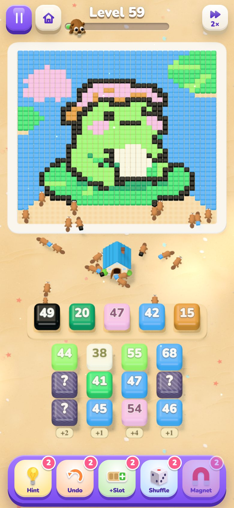
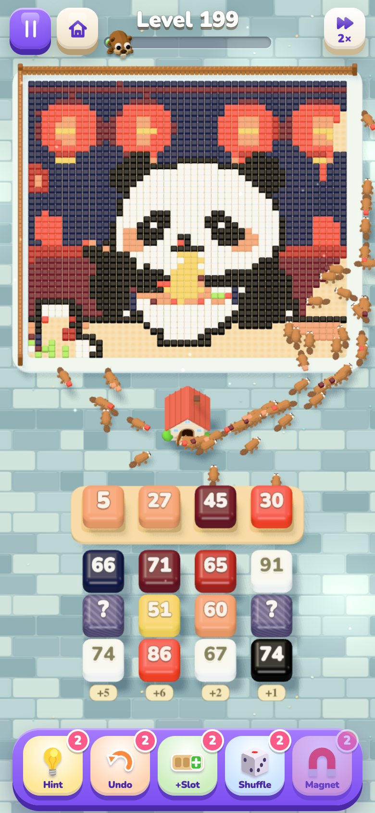
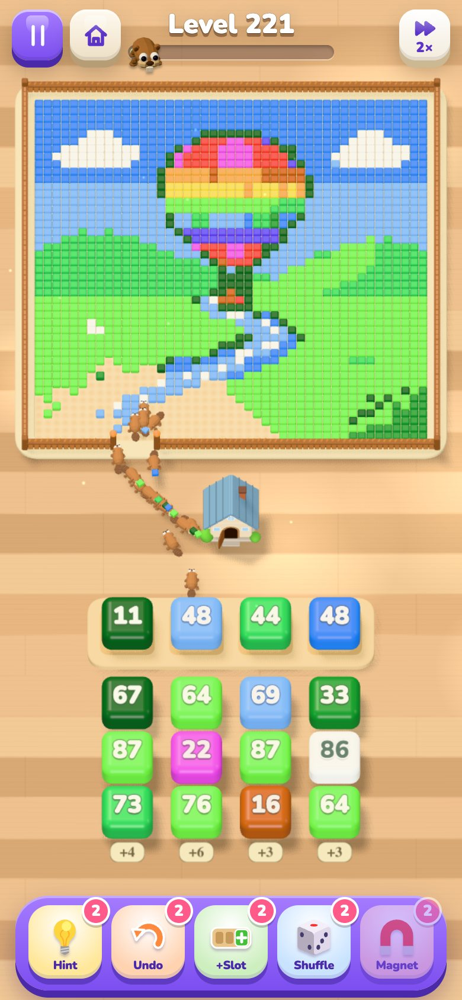

# 🦫 Pixel Picnic

A cozy puzzle game. Tap boxes of beavers and watch them march out and carry a pixel-art picture
home, cube by cube and color by color. Beavers can only reach cubes with a free path to them,
and there are only a few slots. Think ahead, or the colony gets stuck.

### ▶ [Play now](https://evgeny.io/games/pixel-picnic/)

Free in any browser, on phone or desktop. No install, no ads.

<p align="center">
  
  
  
</p>

- 🖼️ **280 illustrated levels**, plus a classic emoji campaign and an endless mode
- 🦫 Beavers, ants, dogs or mice. Foxes, rabbits and little people are in the shop
- 🧩 Mystery boxes, fences, linked boxes, ice and gates
- 💡 Boosters, stars, coins, hats and houses
- 🌙 Night mode, English and Russian

## Development

```bash
npm install
npm run dev      # http://localhost:5173
npm test
```

Pushing to `main` deploys the game. The engine, solver, level generator, picture pipeline and
debug flags are described in [docs/development.md](docs/development.md).

<sub>Illustrated scenes are made with [Z-Image Turbo](https://huggingface.co/Tongyi-MAI/Z-Image-Turbo) (Apache 2.0),
and the paintings come from public-domain scans on Wikimedia Commons (Hokusai, Van Gogh, Vermeer, Audubon via the National Gallery of Art, CC0, and Ohara Koson).
Classic pictures are pixelated from [Fluent Emoji](https://github.com/microsoft/fluentui-emoji) (MIT),
[Twemoji](https://github.com/jdecked/twemoji) (© Twitter, Inc. and contributors, [CC BY 4.0](https://creativecommons.org/licenses/by/4.0/))
and [Noto Emoji](https://github.com/googlefonts/noto-emoji) (© Google Inc., Apache 2.0). UI icons: Fluent Emoji (MIT).
Font: [Nunito](https://fonts.google.com/specimen/Nunito) (OFL 1.1). 3D: [three.js](https://threejs.org) (MIT).</sub>
