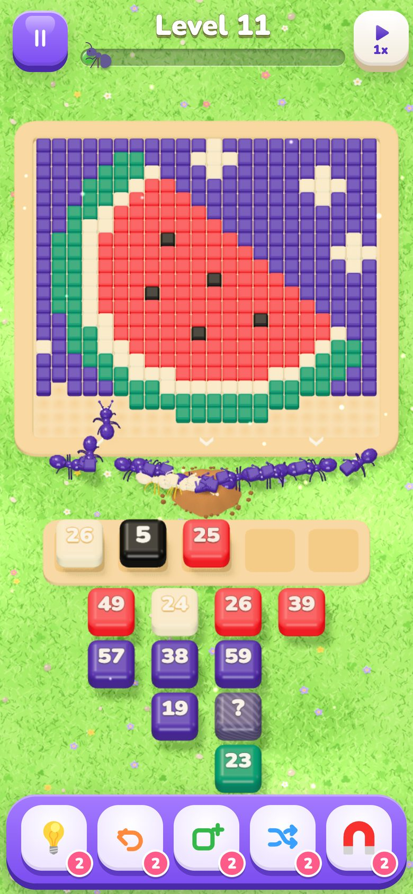
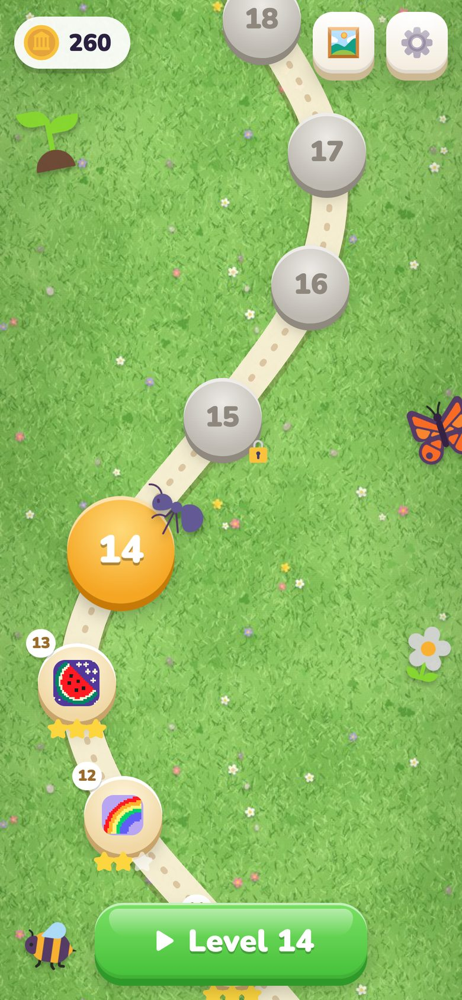
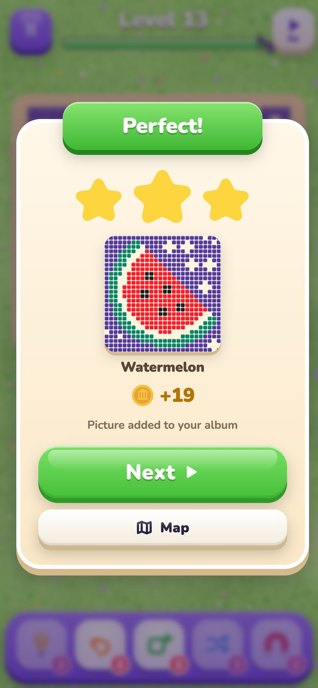
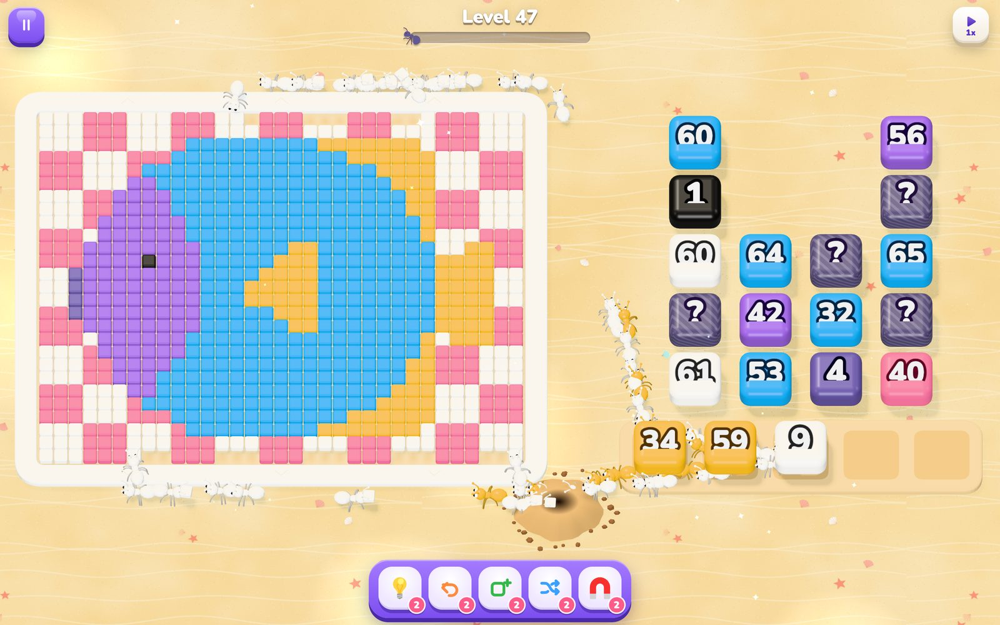

# 🐜 Pixel Picnic

**Feed a hungry ant colony.** Tap boxes of ants and watch them march out, grab the cubes of their
color and carry a 3D pixel‑art picture back to the nest — cube by cube, color by color.
A cozy puzzle game with a surprising amount of planning under the hood.

### ▶ Play now: [evgeny.io/games/pixel-picnic](https://evgeny.io/games/pixel-picnic/)

Works in any modern browser, on phones and on desktop. No install, no ads, no timers.

<p align="center">
  
  
  
</p>
<p align="center">
  
</p>

## How to play

1. Every level is a picture made of colored pieces lying in a wooden tray — cubes, coins, candies,
   hexagons or diamonds, a different look for different pictures.
2. Ants walk around the frame and come in **from any side** that isn't fenced off, then walk over
   free space. **A piece is reachable when there's a free way to it**: from outside, or through the
   tunnels and gaps already eaten into the picture, from any side of the piece.
3. Tap a box at the front of the queue. It hops into a free **slot** (five in the first levels,
   four later) and its ants climb out one after another; each ant heads for a reachable piece of
   its color and claims it. The piece stays in place until its ant has walked up and grabbed it —
   only then is the way to the pieces behind it free. The number on the box is how many ants are
   still inside.
4. You only see the first **three rows** of the queue; deeper boxes rise into view as the columns
   move up. A small "+3" under a column tells how many are still hidden — or, on trickier levels,
   only a "?" says that something is. When a column runs out, the others close ranks. Linked
   boxes stay chained in their slots until both are empty.
5. When a box is empty, its slot frees up. But if every slot holds a color the ants can't reach
   yet, **the colony gets stuck**. Think a few bites ahead: which column hides the color you need,
   and which boxes can you afford to park on the way?

Every 5th level is **hard**, every 10th is **super hard**.

## Features

- **Two campaigns of 280 levels in 14 worlds.** The *illustrated* campaign is built from
  pixel-art scenes — a frog fishing on a lily pad, a snowman by a log cabin, a panda slurping
  ramen, a few masterpieces like Hokusai's Great Wave — on boards that grow from 28 to 60 pieces.
  The *classic* campaign keeps the emoji pictures. New players start on the illustrated levels;
  players with classic progress keep it and get an invitation to try the new ones. A button on the
  map switches between them, and each campaign remembers its own progress (coins, boosters and
  looks are shared). An endless mode generates new levels after each campaign.
- **Mechanics that unlock as you play:**

  | From level | Mechanic |
  |---:|---|
  | 1 | Boxes, five slots, ants coming in from every side (with a short tutorial) |
  | 3 | Four slots (the ➕ booster adds a fifth) |
  | 7 | **Mystery boxes** `?` — the color shows only when the box reaches the front |
  | 11 | **Fences** — ants can't get in through a fenced side of the frame |
  | 14 | **Chained boxes** — linked pairs are taken together and need two free slots |
  | 22 | **Ice** — a frozen box can't be taken until a few more taps have been made |
  | 31 | **Gates** — the only way in is a narrow gap in the fence |

- **Boosters bought with the coins you earn:**

  | Unlocks | Booster | What it does |
  |---:|---|---|
  | 2 | 💡 Hint | Asks the solver for the best next box and highlights it |
  | 3 | ➕ Slot | One extra slot for the rest of the level |
  | 4 | ↩️ Undo | Takes back your last tap |
  | 6 | 🔀 Shuffle | Re-deals the queue into an order that can still be finished |
  | 9 | 🧲 Magnet | Pulls any box out of the middle of the queue |

- **Stars and album** — 3 stars without boosters, 2 with them, 1 if the colony got stuck and you
  rescued it. Every finished picture goes into your album.
- **Coins** — 10 / 25 / 50 for a normal / hard / super hard level, +5 per star and a "Quick!"
  bonus for beating the level's par time (replays pay a third). Spend them in the **shop** on
  boosters, seven looks for the ant house (cottage, mushroom, log cabin, igloo, gingerbread,
  pumpkin, castle tower), box styles (classic, wooden crate, picnic basket and metal case)
  and accessories the whole colony wears (party hats, caps, bows,
  flowers, sunglasses, top hats, Santa hats, crowns) — with 3D previews.
- **Speed** — choose 1× or 2×; after the last box is opened, the remaining collection and return
  trips automatically run at 5×. The next level keeps your chosen manual speed.
- **Always up to date** — the game notices a new deployment and reloads itself on the map.
- **Night mode** — dark grass, moonlight and a dark interface (the pictures keep their colors,
  the ant house lights its windows); automatic with the system's dark theme or on/off in the
  settings.
- **English and Russian**, progress saved in the browser.

## Under the hood

For frame-time diagnostics and geometry budgets, see [Performance checks](docs/performance.md).

- **Deterministic rules engine** ([`src/core/sim.ts`](src/core/sim.ts)). The engine keeps a
  shortest-walk distance field over the free cells — from the nest around the frame to every
  unfenced border cell and on through the tunnels already eaten — and updates it incrementally as
  pieces disappear. Each color keeps a priority queue of reachable pieces keyed by that walk, so
  every 400 ms (at 1×) each occupied slot lets one ant out, heading for the piece of its color that is really
  the closest on foot. The ant claims it, and the piece is carried off when the ant arrives — the
  trip time depends on the distance — which is when the cells behind it open up. The 3D view only animates the resulting events, so the game, the solver
  and the level generator share exactly the same rules.
- **Ant paths** — every ant plans its own route: a breadth-first search over the free cells picks
  the entrance that's most convenient from its slot, the route is smoothed into straight runs, and
  ants politely wait behind cubes that another ant hasn't carried away yet.
- **Solver** ([`src/core/solver.ts`](src/core/solver.ts)). A depth‑first search with memoized dead
  ends proves that every level can be finished. The Hint booster runs it live and tells you when
  your position has become unwinnable.
- **Difficulty is measured, not guessed** ([`src/core/generator.ts`](src/core/generator.ts)). The
  generator builds a queue around a known solution, then plays hundreds of simulated games with
  three players — one tapping **at random**, a "casual" one who only takes colors the ants can
  reach, and a greedy one — and tunes the queue (solver-checked local search: swapping, merging,
  splitting and moving boxes) toward the win-rate band for the level's tier.
  In the original 140-level campaign, tapping at random wins about 10% of the early puzzles
  and practically never after that
  (0.7% on average for normal levels, 0% for hard and super hard ones); a casual player wins about
  12% of normal levels, 4% of hard ones and almost never a super hard one. Levels are also tuned
  so the thinking doesn't end after the first taps (the random player is re-measured from a third
  of the way in). A fourth, **thinking player** plans two or three taps ahead but — like you — only
  sees the visible queue rows: it should win most normal levels (they're fair), about half of the
  hard ones and seldom a super hard one. On top of that the generator counts **critical decisions** — moments on the
  way to victory where a wrong box leads into a dead end: about six per normal level and eight or
  more on hard ones. Fewer queue columns, four slots and fences are extra difficulty levers.
  Level 1 is authored separately: a 110-piece frog with three colors and five boxes. Every front
  box starts collecting immediately, and every order is winnable. Campaign rebuilds preserve it.
  Levels 141–280 combine the existing mechanics with gradually tighter difficulty targets.
  Their boards stay within 34×34 pieces, including the background, and keep four slots.
  Each has a stored solution that the test suite replays without boosters. See
  [the campaign expansion notes](docs/campaign-expansion.md) for the world list and validation.
- **Illustrated pictures** — scenes are drawn by the open Z-Image Turbo model running locally
  (`scripts/art/generate.py`, prompts in `scripts/art/scenes.py`), then converted to the board
  by `scripts/art/pixelart.py`: an OKLab palette from the flat areas of the image, majority
  vote per cell on a finer sub-grid, small high-contrast details (eyes, buttons, stars) put back,
  and thin dark strokes redrawn as continuous one-piece outlines. Colors that players could confuse
  are merged (every pair stays at least 1.25× the in-game readability gap). Too-easy scenes first
  get extra fences; a one-piece border around the picture is the last resort, used on at most a
  fifth of the levels. Level 1 is an authored three-color strawberry tutorial.
- **Classic pictures** — 466 candidate emoji from three open sets (Fluent, Twemoji and Noto, whose
  detailed scenes — cities at night, mountains, lighthouses, castles, fairgrounds — make the
  hardest levels), rasterized, reduced to 3–10 clean colors with k‑means in OKLab, cleaned of stray
  pixels, and placed on patterned backgrounds at 14×13 to 44×44 pieces
  ([`scripts/lib/pixelart.ts`](scripts/lib/pixelart.ts)).
- **Rendering** — three.js with instanced pieces (five shapes), hundreds of instanced ants with
  animated legs, picket fences and gates, golden chains between linked boxes, a little ant
  cottage (the ants walk around it and run in through the open door), soft shadows, a painted
  ground per world and ambient particles (pollen, leaves, fireflies, snow…). Phones get a lighter
  render path automatically.
- **Sound** — every effect and the generative music of each world are synthesized with the Web
  Audio API; there are no audio files.

```
src/core/     rules, solver, difficulty estimation, level generator, progression
src/render/   three.js scene: picture, queue & slots, ants, nest, particles, ground, layouts
src/game/     real-time driver: simulation rounds ↔ animated view, boosters, undo
src/ui/       HUD, dialogs, level map, album (DOM + CSS)
src/app/      app flow, saves, i18n, level loading, endless-mode worker
src/audio/    Web Audio synthesizer (SFX + generative music)
scripts/      emoji → pixel art, campaign builder, UI icons
```

## Development

```bash
npm install
npm run dev      # http://localhost:5173, also reachable from a phone on the same network
npm test         # rules, solver and generator tests
npm run build    # typecheck + production build into dist/
```

Regenerate content (uses [Bun](https://bun.sh)):

```bash
bun scripts/build-pictures.ts   # contact sheets for reviewing the pixel art in .cache/sheets
bun scripts/build-levels.ts     # offline campaign generation → src/data/levels.json
bun scripts/audit-campaign.ts   # verify the expansion, sample difficulty, render contact sheets
bun scripts/build-icons.ts      # UI icons
```

The illustrated campaign (Python 3 with numpy and Pillow, plus [mflux](https://github.com/filipstrand/mflux)
for the image model):

```bash
python3 scripts/art/scenes.py > .cache/art/jobs.jsonl                # scene queue
python scripts/art/generate.py .cache/art/jobs.jsonl .cache/art/gen   # render it (mflux venv)
python3 scripts/art/pictures.py --sheets                             # boards + contact sheets
bun scripts/build-illustrated.ts 2-280                               # queues, one file per level
bun scripts/build-illustrated.ts merge                               # → src/data/levels-illustrated.json
```

`scripts/art/selection.json` picks the image for a level (generated variants, earlier samples or
hand-converted paintings); the builder tries up to three candidates and keeps the first one that
reaches the level's difficulty target.

Use `APPEND=1 bun scripts/build-levels.ts 280` to extend an existing campaign while preserving
its published levels. The builder writes a checkpoint after each level. Use `REBUILD=141,145`
to regenerate selected levels, or `BASE=src/data/levels.json LEVELS=141,142` with a separate output
path to build an isolated batch. Generation and the full difficulty audit can take several minutes.
`RESUME=1` continues an interrupted batch from its checkpoint.

**Debug mode** (Settings → Debug mode, or `?debug=1`): every level is unlocked, the map shows each
level's difficulty, the 🐞 button opens a list of all levels with their picture and numbers
(simulated win rates, size, boxes, mechanics), and the pause menu gets *Auto-solve* (the solver
plays the level) and *Skip level*.

Other URL flags: `?level=25` jumps to a level, `?boosters=5`, `?coins=999`, `?progress=14`,
`?demo` (the colony plays by itself), `?looks=mushroom,party,basket` (house, hat, boxes), `?reset`.

Pushing to `main` runs the tests, builds the game and publishes it to
`evgeny.io/games/pixel-picnic/`. The `SITE_DEPLOY_KEY` Actions secret holds the private half of
a dedicated SSH deploy key; its public half must have write access to
`evgenyio/evgenyio.github.io`. The workflow updates only `games/pixel-picnic/` on the site's
`master` branch, which triggers GitHub Pages. It fails if the key is missing and confirms that
the public `version.json` matches the new build before reporting success. Runs are serialized;
an outdated game commit skips publishing when a newer `main` commit is already available.

## Credits & licenses

- Illustrated campaign: scenes generated with [Z-Image Turbo](https://huggingface.co/Tongyi-MAI/Z-Image-Turbo)
  (Apache License 2.0), converted to pixel art. Paintings from public-domain scans on Wikimedia
  Commons: Katsushika Hokusai, Vincent van Gogh, Johannes Vermeer, John James Audubon (National
  Gallery of Art, CC0), Ohara Koson.
- Classic campaign pictures are generated from emoji:
  - [Microsoft Fluent Emoji](https://github.com/microsoft/fluentui-emoji) — MIT License.
  - [Twemoji](https://github.com/jdecked/twemoji) — © Twitter, Inc. and other contributors,
    graphics licensed under [CC BY 4.0](https://creativecommons.org/licenses/by/4.0/).
  - [Noto Emoji](https://github.com/googlefonts/noto-emoji) — © Google Inc., Apache License 2.0.
  - All pictures are modified: rasterized, recolored and pixelated.
- UI icons: Microsoft Fluent Emoji (MIT).
- Font: [Nunito](https://fonts.google.com/specimen/Nunito) — SIL Open Font License 1.1.
- 3D engine: [three.js](https://threejs.org) — MIT.
